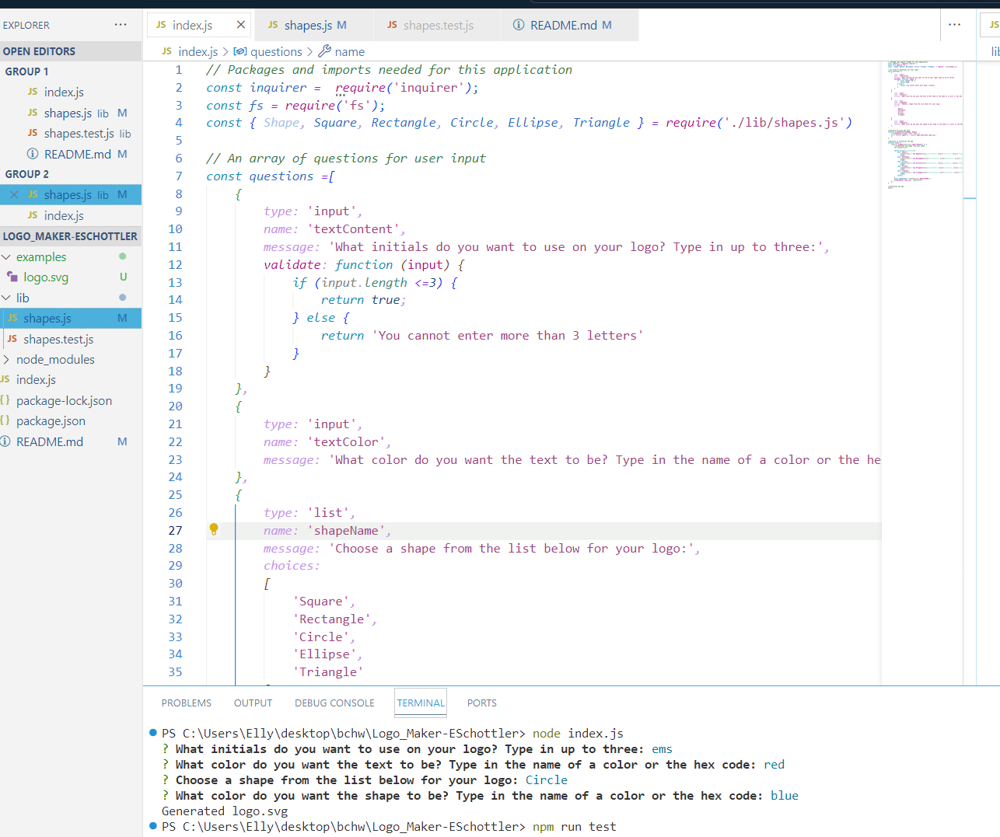

# Logo_Maker-ESchottler

## Description

An application to make a basic logo with your choice of initials, color, and shape. This application is validated with tests run with jest.

## Installation

Run 'npm i' in the terminal, run 'node index.js', answer the prompts and find your logo.svg created after the prompts have been answered.  

## Usage

View a walkthrough video to see how to use this application: https://drive.google.com/file/d/1yZC46krjcoVO1qnCcS8t43JKk4BGUiBT/view

A screenshot of this application in use: 

## Credits

This project was created with the criteria and guidance from UofM-VIRT-FSF-PT-08-2023-U-LOLC.

## License
N/A

